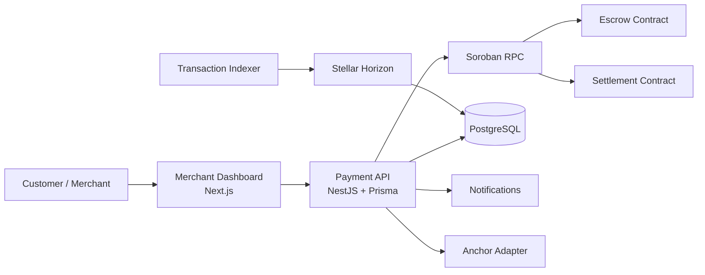
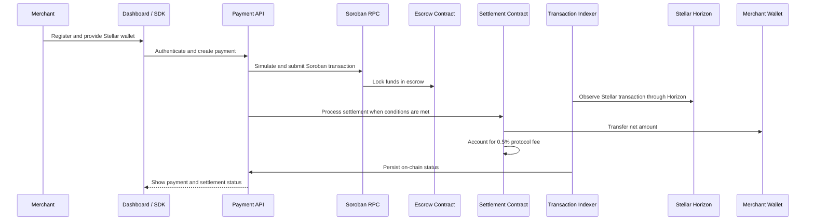
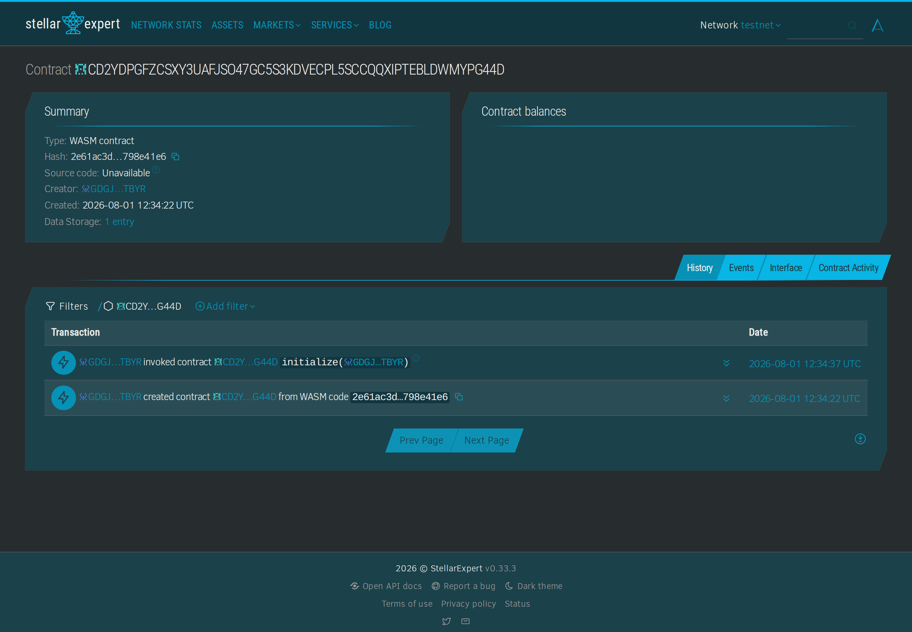
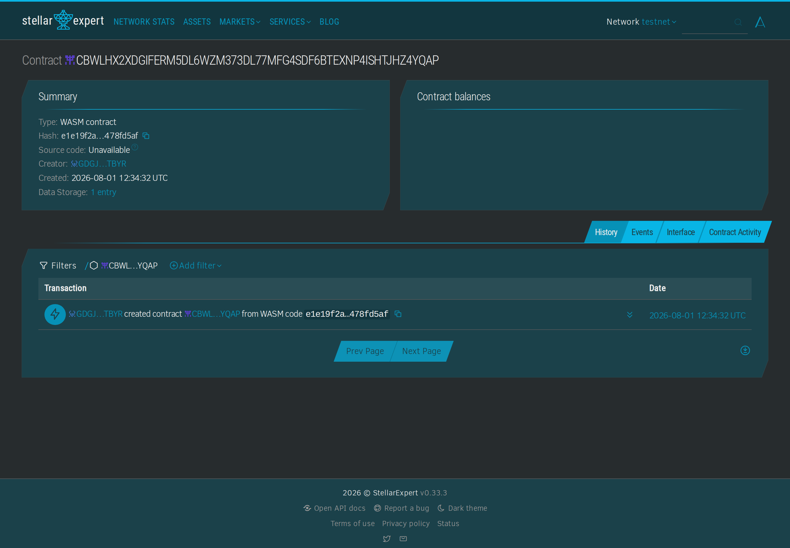
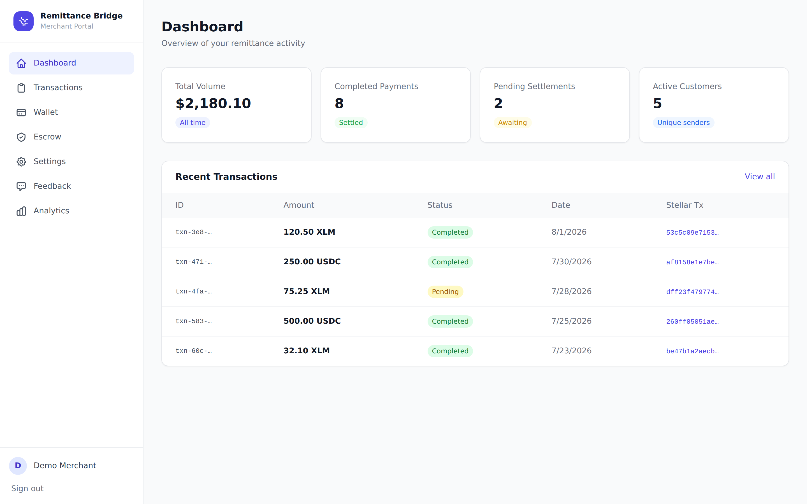
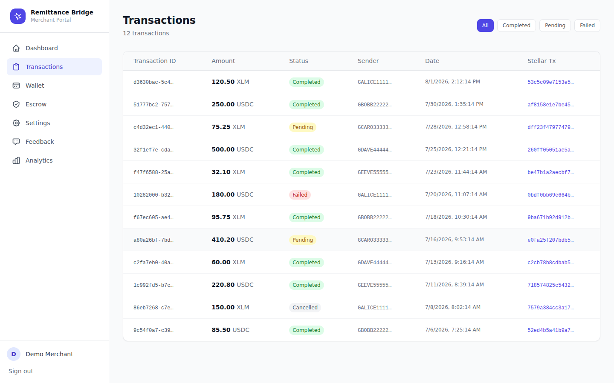
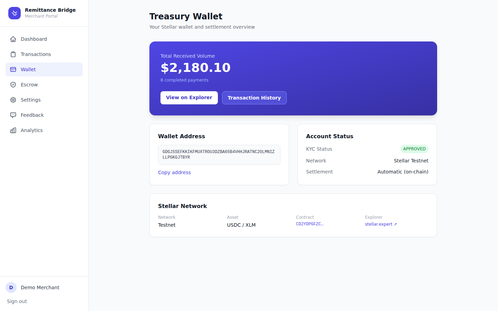
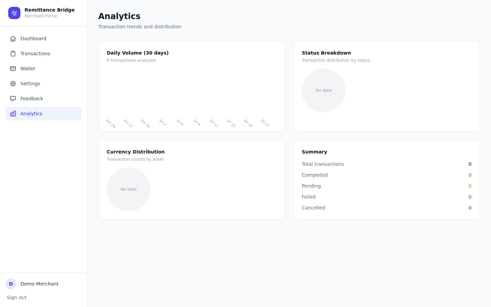
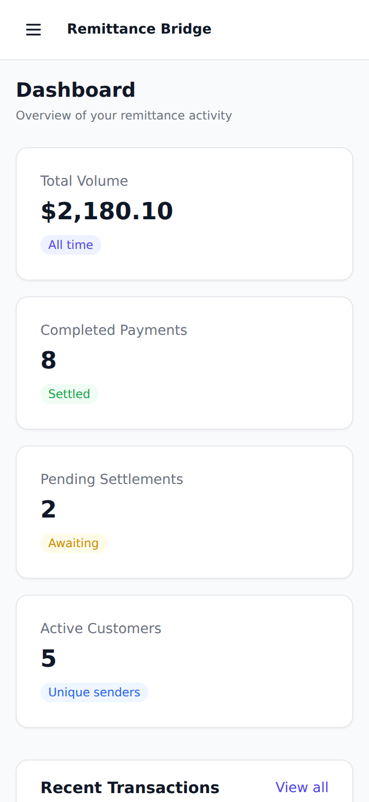
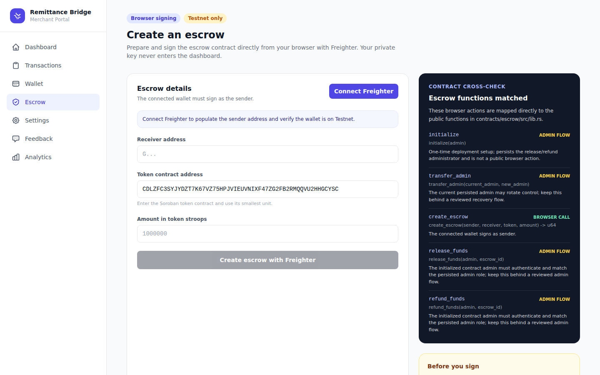

# 🌎 Global Micro-Remittance Bridge

An open-source infrastructure enabling Small and Medium Enterprises (SMEs) to receive affordable, instant international payments via the **Stellar network** and **Soroban smart contracts**. No bank account required.

## 📌 Project Description

The **Global Micro-Remittance Bridge** is a Stellar-based payment platform for merchants that need to receive cross-border funds quickly and transparently. It combines a merchant dashboard, a NestJS payment API, Soroban escrow and settlement contracts, and blockchain indexing into one open-source reference implementation.

The platform is designed around a simple flow: a merchant onboards with a Stellar wallet address, a payment is initiated through the API or dashboard, funds are represented and tracked on Stellar, and the settlement layer can distribute the merchant amount and protocol fee. The current public deployment is a **Stellar Testnet demonstration**; it is not a production Mainnet payment service.

## 👁️ Project Vision

Our vision is to make international commerce accessible to small businesses that are underserved by traditional banking rails. By combining Stellar's fast settlement with transparent Soroban logic and a focused merchant experience, the Bridge aims to reduce payment friction, make costs understandable, and give merchants verifiable ownership of their settlement history.

## 🔗 Live Links

| Resource | URL |
|---|---|
| **Live Demo** | [https://merchant-dashboard-rosy.vercel.app](https://merchant-dashboard-rosy.vercel.app) |
| **Payment API** | [https://global-remittance-api.onrender.com](https://global-remittance-api.onrender.com) |
| **GitHub Repo** | [https://github.com/Timrossid/global-remittance-bridge](https://github.com/Timrossid/global-remittance-bridge) |
| **Stellar Testnet Explorer** | [https://stellar.expert/explorer/testnet](https://stellar.expert/explorer/testnet) |
| **Escrow Contract** | [CD2YDPGFZCSXY3UAFJSO47GC5S3KDVECPL5SCCQQXIPTEBLDWMYPG44D](https://stellar.expert/explorer/testnet/contract/CD2YDPGFZCSXY3UAFJSO47GC5S3KDVECPL5SCCQQXIPTEBLDWMYPG44D) |
| **Settlement Contract** | [CBWLHX2XDGIFERM5DL6WZM373DL77MFG4SDF6BTEXNP4ISHTJHZ4YQAP](https://stellar.expert/explorer/testnet/contract/CBWLHX2XDGIFERM5DL6WZM373DL77MFG4SDF6BTEXNP4ISHTJHZ4YQAP) |
| **Demo Video** | ▶️ **[Watch on GitHub Releases (demo-recording-v1)](https://github.com/Timrossid/global-remittance-bridge/releases/tag/demo-recording-v1)** — 2-min walkthrough of sign-in/register → dashboard → transactions → wallet → analytics → feedback. Direct downloads: [demo-recording.mp4](https://github.com/Timrossid/global-remittance-bridge/releases/download/demo-recording-v1/demo-recording.mp4) (H.264 · broadest compatibility) · [demo-recording.webm](https://github.com/Timrossid/global-remittance-bridge/releases/download/demo-recording-v1/demo-recording.webm). |
| **Google Form (Feedback)** | [https://forms.gle/QgempCFKcho8PwgA7](https://forms.gle/QgempCFKcho8PwgA7) — live public survey: Name, Email, Wallet Address, Network (Testnet/Mainnet), Product Rating + 5 feedback questions (see [form spec](docs/FEEDBACK_FORM_SPEC.md)). |
| **Feedback Excel Export** | ⏳ _Pending owner export_ — generated by [`payment-api/scripts/export-feedback-to-xlsx.ts`](payment-api/scripts/export-feedback-to-xlsx.ts); public link added here once 10+ real responses are collected. |

---

## 🚀 Key Features

- **Trustless Escrow** — Soroban smart contract holds funds until confirmed delivery; the settlement path calculates a 0.5% protocol fee for the treasury.
- **Real-time Settlement** — The Payment API submits and confirms Stellar/Soroban transactions while the indexer reconciles on-chain activity via Horizon.
- **Merchant Dashboard** — Production Next.js portal with auth, transaction history, wallet view, settings, and user feedback collection.
- **Submission Pack** — Screenshots, demo video notes, and feedback collection guidance are now documented in [screenshots/README.md](screenshots/README.md).
- **REST API** — NestJS backend with JWT authentication, Prisma ORM, and full CRUD for merchants and transactions.
- **Analytics** — Vercel Analytics integrated for page-view and engagement tracking.
- **Responsive UI** — Mobile-first Tailwind CSS design, tested on 375px–1440px viewports.

---

## 📂 Repository Structure

```
global-remittance-bridge/
├── contracts/
│   ├── escrow/          # Soroban escrow contract (Rust) — creates/releases/refunds escrows
│   │   └── src/test.rs  # token transfer and state-transition tests
│   └── settlement/      # Soroban settlement contract (Rust) — processes payouts with fee distribution
│       └── src/test.rs  # fee, admin, and validation tests
├── payment-api/         # NestJS REST API — auth, merchants, payments, Stellar integration
├── merchant-dashboard/  # Next.js 14 merchant portal — dashboard, transactions, wallet, settings
├── transaction-indexer/ # Stellar event monitor and DB synchronizer
├── anchor-adapter/      # Fiat on/off-ramp integration layer
├── notification-service/# Email/SMS/webhook notification engine
├── sdk/                 # Developer SDK for merchant integrations
├── website/             # Marketing and docs site
├── infrastructure/      # Docker Compose and deployment configs
├── docs/                # Architecture, API guide, deployment docs
├── screenshots/         # Submission screenshots
└── demo-app/            # Reference merchant implementation
```

---

## 🛠️ Tech Stack

| Layer | Technology |
|---|---|
| Blockchain | Stellar Network + Soroban Smart Contracts (Rust) |
| Backend | NestJS, TypeScript, PostgreSQL (Supabase), Prisma ORM, Redis, BullMQ |
| Frontend | Next.js 14, Tailwind CSS, TypeScript, Vercel Analytics |
| Auth | JWT (passport-jwt), salted HMAC-SHA256 passwords |
| DevOps | Docker, GitHub Actions, Vercel (frontend), Railway/Render (API) |

---

## ⚡ Quick Start

### Prerequisites

- Node.js 18+
- Rust + `stellar` CLI (`cargo install stellar-cli`)
- PostgreSQL (or a free [Supabase](https://supabase.com) project)
- Redis (or [Upstash](https://upstash.com) free tier)

### 1. Clone the repo

```bash
git clone https://github.com/Timrossid/global-remittance-bridge.git
cd global-remittance-bridge
```

### 2. Deploy the Soroban contracts to testnet

```bash
cd contracts

# Fund a testnet account (do this once)
stellar keys generate --global deployer --network testnet
stellar keys fund deployer --network testnet

# Build the escrow contract
cd escrow
stellar contract build

# Deploy the escrow contract
stellar contract deploy \
  --wasm target/wasm32v1-none/release/escrow.wasm \
  --source deployer \
  --network testnet
# → Copy the returned contract address (C...) — you'll need it below

# Build and deploy the settlement contract
cd ../settlement
stellar contract build
stellar contract deploy \
  --wasm target/wasm32v1-none/release/settlement.wasm \
  --source deployer \
  --network testnet
# → Copy this contract address too
```

### 3. Set up the Payment API

```bash
cd ../../payment-api
cp .env.example .env
# Edit .env: fill in DATABASE_URL, DIRECT_URL, JWT_SECRET, STELLAR_SECRET, SOROBAN_CONTRACT_ID

npm install
npx prisma migrate deploy
npm run start:dev
# API will be running at http://localhost:3001
```

### 4. Set up the Merchant Dashboard

```bash
cd ../merchant-dashboard
cp .env.example .env.local
# Edit .env.local: set NEXT_PUBLIC_API_URL=http://localhost:3001
#                  set NEXT_PUBLIC_CONTRACT_ID=<your C... address>
#                  set NEXT_PUBLIC_SOROBAN_RPC_URL=https://soroban-testnet.stellar.org
#                  set NEXT_PUBLIC_ESCROW_TOKEN_ID=<Testnet token C... address>

npm install
npm run dev
# Dashboard at http://localhost:3000
```

---

## 🔑 API Reference

### Authentication

```http
POST /auth/register
Content-Type: application/json

{
  "name": "Acme Corp",
  "email": "merchant@acme.com",
  "password": "securepass123",
  "walletAddress": "GABC..."
}
→ { "access_token": "eyJ...", "merchant_id": "uuid", "merchant": {...} }
```

```http
POST /auth/login
Content-Type: application/json

{ "email": "merchant@acme.com", "password": "securepass123" }
→ { "access_token": "eyJ...", "merchant": {...} }
```

### Merchant

```http
GET /merchants/me                    # Get authenticated merchant profile
GET /merchants/me/stats              # Get dashboard stats
GET /merchants/me/transactions       # Get transaction history
```

### Payments

```http
POST /payments/transfer              # Initiate a direct Stellar payment
POST /payments/create                # Create a payment record
GET  /payments/:id                   # Get a single payment
PUT  /payments/:id/status            # Update payment status
```

All protected endpoints require `Authorization: Bearer <token>`.

---

## 📜 Smart Contract Details

### Escrow Contract (`contracts/escrow`)

```rust
// Initialize the one-time persisted administrator
initialize(admin)

// Rotate the persisted administrator (current admin must authenticate)
transfer_admin(current_admin, new_admin)

// Create a new escrow — locks tokens until released or refunded
create_escrow(sender, receiver, token, amount) -> escrow_id

// Release funds to receiver (requires the persisted admin)
release_funds(admin, escrow_id)

// Refund to original sender (requires the persisted admin)
refund_funds(admin, escrow_id)
```

**State machine:** `PENDING (0)` → `RELEASED (1)` or `REFUNDED (2)`

### Settlement Contract (`contracts/settlement`)

```rust
// Process a settlement: transfers net amount to merchant, fee to treasury
// Fee rate: 50 bps (0.5%)
process_settlement(sender, merchant, treasury, token, amount)

// Distribute accumulated protocol fees to treasury
distribute_fees(admin, treasury, token, fee_amount)

// View helpers
get_last_settlement() -> (amount, net, fee)
get_fee_bps() -> i128
```

---

## 🏗️ Architecture

The system is split into an off-chain application layer and an on-chain settlement layer:



### Payment and settlement flow



For component rationale and data-flow notes, see [docs/ARCHITECTURE.md](docs/ARCHITECTURE.md). The concrete trust-boundary, payment-sequence, administrative-lifecycle, and deployment-promotion diagrams are maintained in [docs/ARCHITECTURE_DIAGRAMS.md](docs/ARCHITECTURE_DIAGRAMS.md).

---

## 🌐 Mainnet / Testnet Contract Details

The contracts below are deployed and publicly inspectable on **Stellar Testnet**. There are currently **no Mainnet contract IDs** for this project, and the Testnet deployments must not be treated as production Mainnet deployments.

| Contract | Network | Contract ID | Explorer |
|---|---|---|---|
| Escrow | Stellar Testnet (hardened, initialized) | `CD2YDPGFZCSXY3UAFJSO47GC5S3KDVECPL5SCCQQXIPTEBLDWMYPG44D` | [View on Stellar Expert](https://stellar.expert/explorer/testnet/contract/CD2YDPGFZCSXY3UAFJSO47GC5S3KDVECPL5SCCQQXIPTEBLDWMYPG44D) |
| Settlement | Stellar Testnet | `CBWLHX2XDGIFERM5DL6WZM373DL77MFG4SDF6BTEXNP4ISHTJHZ4YQAP` | [View on Stellar Expert](https://stellar.expert/explorer/testnet/contract/CBWLHX2XDGIFERM5DL6WZM373DL77MFG4SDF6BTEXNP4ISHTJHZ4YQAP) |

### Deployed contract proof

The screenshots below show the currently live hardened contracts on the Stellar Testnet block explorer (Stellar Expert), both deployed by the Environment-gated deployment workflow on 2026-08-01:



*Escrow contract `CD2YDPGFZCSXY3UAFJSO47GC5S3KDVECPL5SCCQQXIPTEBLDWMYPG44D` on Stellar Expert — WASM contract, creator `GDGJSSE…`, created 2026-08-01 12:34:22 UTC, 1 data-storage entry.*



*Settlement contract `CBWLHX2XDGIFERM5DL6WZM373DL77MFG4SDF6BTEXNP4ISHTJHZ4YQAP` on Stellar Expert — WASM contract, creator `GDGJSSE…`, created 2026-08-01 12:34:32 UTC, 1 data-storage entry (deployed; its `initialize(admin)` is pending — see Contract responsibilities).*

The original historical pre-hardening deployment screenshot is retained at [`screenshots/contract-deployed.png`](screenshots/contract-deployed.png).

### Contract responsibilities

- **Escrow:** `initialize(admin)` persists a one-time administrator in instance storage and maintains its TTL when the role is initialized, rotated, or used. `transfer_admin` requires both old and new administrator authentication. `create_escrow` requires initialization before transferring tokens, then records sender, receiver, token, amount, and status. `release_funds` and `refund_funds` require both authentication and equality with the persisted admin role. The IDs above were deployed by the Environment-gated Testnet workflow and the escrow was initialized with the deployer as administrator on Stellar Testnet (init tx `8fba6632d110e75a17f42db64e6e13706c8f00ee7be149e532e810aeeaedca90`).
- **Settlement:** `process_settlement` transfers the net amount to the merchant and the 50-basis-point (0.5%) fee to the treasury. `initialize` and `distribute_fees` provide administrative state and fee distribution controls. The live settlement instance `CBWLHX2XDGIFERM5DL6WZM373DL77MFG4SDF6BTEXNP4ISHTJHZ4YQAP` was deployed by the earlier Environment-gated Testnet run that initialized only escrow, so it is not yet initialized; run `initialize(admin)` with the deployer against that instance before using `distribute_fees` (the deployer secret is available only in the `stellar-testnet` GitHub Environment, so this is done via the approved deploy job or a trusted environment; re-running the gated deploy job instead deploys a fresh pair of contracts — now initialized by the job — producing new IDs that would need re-promotion).
- **Verification:** Testnet transaction evidence is listed in [`screenshots/DEMO_SUBMISSION_NOTES.md`](screenshots/DEMO_SUBMISSION_NOTES.md), including 12 successful Stellar Testnet transaction hashes. These demonstrate wallet activity and are not all limited to the two application contracts.

## 🚢 Deployment

### Frontend (Vercel)

1. Import repo to Vercel
2. Set environment variables:
   - `NEXT_PUBLIC_API_URL` → your deployed API URL
   - `NEXT_PUBLIC_CONTRACT_ID` → deployed escrow contract C-address
   - `NEXT_PUBLIC_NETWORK` → `testnet`
3. Deploy — Vercel Analytics auto-activates

### Backend API (Railway / Render)

1. Connect your GitHub repo
2. Set all variables from `payment-api/.env.example`
3. Build command: `npm run build`
4. Start command: `npm run start:prod`
5. Run migrations: `npx prisma migrate deploy`

### Smart contracts (GitHub Actions, Testnet only)

Run `.github/workflows/soroban.yml` manually with `deploy_testnet=true` after configuring the protected `stellar-testnet` GitHub Environment. The Environment must contain:

- `STELLAR_TESTNET_DEPLOYER_PUBLIC_KEY` — the public `G...` account used as the transaction source.
- `STELLAR_TESTNET_DEPLOYER_SECRET` — the matching private signing key, exposed only to the approved deployment job through Stellar CLI’s `STELLAR_SIGN_WITH_KEY` environment variable.

The job runs the verified contract CI first, downloads the exact WASM artifacts from that run, submits only to Stellar Testnet, validates the returned contract C-addresses, initializes both escrow and settlement with the deployer as administrator, and writes the contract IDs to the workflow summary. Configure required reviewers in the Environment; a workflow `environment` declaration alone does not create an approval gate. Never use this path with Mainnet credentials.

---

## 🎬 Demo Video

A 2-minute silent walkthrough of the live dashboard is published on GitHub as [Release demo-recording-v1](https://github.com/Timrossid/global-remittance-bridge/releases/tag/demo-recording-v1), with both the `.webm` and an H.264 `.mp4` attached as release assets (the MP4 plays in virtually any browser/player).

- 📺 View release: <https://github.com/Timrossid/global-remittance-bridge/releases/tag/demo-recording-v1>
- ⬇️ Direct downloads: [demo-recording.mp4](https://github.com/Timrossid/global-remittance-bridge/releases/download/demo-recording-v1/demo-recording.mp4) (≈1.7 MB · H.264) · [demo-recording.webm](https://github.com/Timrossid/global-remittance-bridge/releases/download/demo-recording-v1/demo-recording.webm) (≈6.9 MB)

The recording is reproducible from scratch:

```bash
cd merchant-dashboard
npm run demo:install-browser   # one-time: pulls Playwright Chromium
npm run demo:record            # re-renders the recording into screenshots/demo-recording.webm
```

The script (`merchant-dashboard/scripts/record-demo.mjs`)

- Registers a fresh merchant via the live `/register` form
- Walks through Dashboard → Transactions → Wallet → Analytics → Feedback
- Overlays on-screen captions per section (silent-friendly)
- Pins the recorded wall-clock to exactly 2:00 via per-section budgets

---

## 📣 User Feedback

The merchant dashboard ships a built-in [`/feedback`](https://merchant-dashboard-rosy.vercel.app/feedback)
page that collects the full onboarding/feedback survey required for user testing:
**Name, Email, Wallet Address, Network (Testnet/Mainnet), Product Rating (1–5)**, plus
the feedback questions *"Which feature did you like the most?", "What feature do you
think is missing?", "Did you encounter any bugs or usability issues?", "Would you
recommend this product to others?", and "What improvements would you like to see?"*.

The form pre-fills the merchant's Name/Email/Wallet Address, stores every response in
`localStorage` (so nothing is lost offline), POSTs to the new `POST /feedback` API
endpoint, and can be mirrored to a public **Google Form** by setting
`NEXT_PUBLIC_FEEDBACK_FORM_URL`. Responses are exported to a public **Excel** sheet via
`payment-api/scripts/export-feedback-to-xlsx.ts`. See
[`docs/USER_FEEDBACK.md`](docs/USER_FEEDBACK.md) and
[`docs/FEEDBACK_FORM_SPEC.md`](docs/FEEDBACK_FORM_SPEC.md) for full details.

### Users Onboarded

> Data pending the owner's live Google Form + testnet onboarding drive. Once 10+ real,
> wallet-interacting users submit the form, the rows below are filled from the exported
> Excel sheet (regenerable with the export script).

| User ID | Name | Email | Wallet Address | Feedback Summary |
|---|---|---|---|---|
| _pending_ | _pending_ | _pending_ | _pending_ | _pending_ |

### Feedback Implementation

> Each real response maps to an improvement + Git commit once collected.

| User ID | Name | Email | Wallet Address | Feedback Summary | Improvement Made | Git Commit ID |
|---|---|---|---|---|---|---|
| _pending_ | _pending_ | _pending_ | _pending_ | _pending_ | _pending_ | _pending_ |

### Improvement Summary

See the commit-linked improvement log in [`docs/USER_FEEDBACK.md`](docs/USER_FEEDBACK.md)
and the CI/CD, contract, and UX delivery described throughout this README. New feedback
collected during the onboarding drive is triaged weekly and linked to the corresponding
commit in the tables above.

---

## 📊 Analytics & Monitoring

- **Vercel Analytics** — Integrated in the merchant dashboard (`@vercel/analytics`). Tracks page views, unique visitors, and navigation patterns automatically on Vercel deployments.
- **Sentry** — Error and performance monitoring via `@sentry/nextjs` (`sentry.client.config.ts`, `sentry.server.config.ts`, `sentry.edge.config.ts`, `instrumentation.ts`). Captures client/server/edge exceptions to the `merchant-dashboard` project. Configure `NEXT_PUBLIC_SENTRY_DSN` (and `SENTRY_AUTH_TOKEN` for source maps) in your Vercel environment; the SDK is disabled locally when no DSN is set.
- **PostHog** — Product analytics + session replay via `posthog-js`. A `PHProvider` wraps the app and `captureEvent` tracks key engagement (register, login, feedback). Configure `NEXT_PUBLIC_POSTHOG_KEY` / `NEXT_PUBLIC_POSTHOG_HOST`.
- **Custom Analytics Page** — `/analytics` provides daily volume trends, status breakdowns, and currency distribution charts using the `GET /merchants/me/analytics` API.
- **GitHub Actions** — CI runs lint, build, and tests on every push/PR.
- **Stellar Expert** — All on-chain transactions are publicly visible at `https://stellar.expert/explorer/testnet`.

---

## 🤝 User Onboarding Details

### For merchants using the live demo

1. Open the [Merchant Dashboard](https://merchant-dashboard-rosy.vercel.app).
2. Select **Register** and provide a business name, email, password, and Stellar wallet address.
3. Sign in after registration if the session has expired.
4. Review the dashboard, transactions, wallet, analytics, and feedback pages.
5. Use the Testnet explorer links above to independently inspect contract and transaction activity.

### For developers running locally

1. Clone the repository and install the prerequisites described in [Quick Start](#-quick-start).
2. Configure the Payment API with database, JWT, Stellar, Soroban RPC, and contract environment variables.
3. Configure the dashboard with `NEXT_PUBLIC_API_URL`, `NEXT_PUBLIC_NETWORK=testnet`, and the escrow `NEXT_PUBLIC_CONTRACT_ID`.
4. Start the API and dashboard, then register a test merchant using a new Stellar-style wallet address.
5. Use only test credentials and testnet assets while evaluating the project. Do not submit production secrets or real funds.

The onboarding flow is intentionally wallet-address based in this demonstration. Production onboarding would require a complete, jurisdiction-aware KYC/AML and custody model before Mainnet use.

For proof of wallet interactions, see the [screenshots/](screenshots/) directory and the Stellar Testnet contract explorer.

---

## 📣 Social Media and Community Links

**Official project presence (verified):**

- [GitHub repository](https://github.com/Timrossid/global-remittance-bridge) — the project's source code, issues, and discussions.
- [GitHub organization profile](https://github.com/Global-Micro-Remittance-Bridge) — the project's organization account, related repositories, and community documentation.

**Platform and community resources:**

- [Stellar Developer Documentation](https://developers.stellar.org/docs) — platform documentation for contributors.
- [Stellar Testnet Explorer](https://stellar.expert/explorer/testnet) — public on-chain verification.

**Submission gap:** no project-owned X/Twitter, Discord, Telegram, or LinkedIn handle is published yet. The GitHub repository and organization profile above are the project's verified official presence and the primary social/community channels today; add official accounts for the other platforms here when they are created and verified.

---

## 📸 Screenshots

Fresh captures of the current merchant dashboard, rendered against Stellar Testnet with the live hardened escrow contract (`CD2YDP…`). The screenshots were captured against the **real running full stack** (dashboard → local Payment API → local Postgres) logged in as the seeded demo merchant, so every row is the actual seeded data — the 12 verified Testnet hashes listed in [`screenshots/testnet_traction.csv`](screenshots/testnet_traction.csv). No route interception or mocked API responses were used.



*Dashboard — live volume, completed/pending settlements, active customers, and the five most recent transactions.*



*Transactions — full history with status filters (All / Completed / Pending / Failed), sender wallet, date, and per-row Stellar Expert links.*



*Treasury Wallet — received volume, wallet address with copy, KYC status, network, and settlement details.*



*Analytics — 30-day daily volume chart, status and currency breakdown donuts, and summary statistics.*



*Mobile responsive dashboard (375px viewport).*



*Escrow — browser-signing form wired to the hardened escrow contract `CD2YDP…` (embedded in the served bundle; the wallet page shows the on-screen truncated reference), with the **Connect Freighter** button, pre-filled native-XLM token contract, amount in stroops, and the contract cross-check panel mapping `create_escrow` (browser call) vs `release_funds` / `refund_funds` (admin flows).*

Deployed-contract proof on the Stellar Testnet block explorer is shown in the [Mainnet / Testnet Contract Details](#-mainnet--testnet-contract-details) section above; proof of the 12 verified Stellar Testnet wallet interactions is listed in [`screenshots/testnet_traction.csv`](screenshots/testnet_traction.csv) and [`screenshots/DEMO_SUBMISSION_NOTES.md`](screenshots/DEMO_SUBMISSION_NOTES.md).

---

## 🔍 AI Assessment and Validation Status

This section records the repository assessment requested for Levels 4–7. It is deliberately explicit about what is present and what remains to be added.

### Smart contract folder structure — **validated**

A valid Soroban workspace is present:

```text
contracts/
├── Cargo.toml                 # Rust workspace: escrow + settlement
├── Cargo.lock                 # locked dependency graph
├── escrow/
│   ├── Cargo.toml
│   └── src/
│       ├── lib.rs             # EscrowContract
│       └── test.rs            # token and state-transition tests
└── settlement/
    ├── Cargo.toml
    └── src/
        ├── lib.rs             # SettlementContract
        └── test.rs            # fee, admin, and validation tests
```

Both contracts use `#![no_std]`, `soroban-sdk`, `#[contract]`, and `#[contractimpl]`. The implementation contains project-specific payment logic rather than a boilerplate Hello World contract.

### Smart contract code — **validated**

- `escrow/src/lib.rs` implements token transfers, escrow creation, persistent state, release, refund, and a pending/released/refunded state machine.
- `settlement/src/lib.rs` implements initialization, positive-amount checks, merchant/treasury fee distribution, last-settlement state, and a 50 bps fee accessor.

### Application integration — **partially validated**

The backend contains the live integration path: `payment-api/src/common/stellar.service.ts` imports `@stellar/stellar-sdk`; `payment-api/src/common/soroban.service.ts` wraps Soroban JSON-RPC; and `payment-api/src/payments/payment.service.ts` builds, simulates, submits, and confirms a Soroban escrow transaction using `SOROBAN_CONTRACT_ID`.

The merchant dashboard now includes a direct, user-initiated Testnet integration at `/escrow`: `merchant-dashboard/lib/soroban.ts` uses `@stellar/stellar-sdk` for contract-call XDR, Soroban RPC simulation/assembly/submission, and `@stellar/freighter-api` for wallet access and signing. The `/escrow` page maps `create_escrow(sender, receiver, token, amount)` to the connected wallet and visibly cross-checks `release_funds(admin, escrow_id)` and `refund_funds(admin, escrow_id)` as protected admin flows that are not exposed as arbitrary browser actions. The backend API remains the integration layer for its existing server-side payment flow; the browser flow never handles private keys and is restricted to Stellar Testnet.

### CI/CD assessment — **substantially covered**

- **Smart contract tests and CI:** `contracts/escrow/src/test.rs` and `contracts/settlement/src/test.rs` provide eleven meaningful Soroban unit tests covering token locking, release/refund state transitions, settlement fee splitting, one-time initialization, admin checks, and invalid amounts. `.github/workflows/soroban.yml` runs formatting, WASM-target checks, `cargo test --workspace`, Clippy, and `stellar contract build` on contract changes and manual runs.
- **Frontend/API CI:** `.github/workflows/test.yml` runs three isolated Payment API RPC unit tests through Jest and three Playwright Chromium tests: dashboard login, authenticated escrow wallet connection, and a deterministic mocked Soroban flow covering transaction simulation, SDK assembly, Freighter signing handoff, submission, `NOT_FOUND` polling, and success rendering. The wallet/RPC seams are CI-only and non-production; no real funds or wallet extension are used. `.github/workflows/build.yml` continues to build both applications, while `lint.yml` runs their linters. The dashboard tests start a local Next.js server and do not require a wallet, database, or production API.
- **Frontend CD:** `merchant-dashboard/.github/workflows/deploy.yml` deploys the dashboard to Vercel using repository secrets.
- **Smart contract CD:** `.github/workflows/soroban.yml` exposes two manual options: `prepare_testnet` packages verified WASM artifacts for review, while `deploy_testnet` submits both contracts to Stellar Testnet only after the `stellar-testnet` GitHub Environment is approved. The deploy job requires the public deployer key plus the `STELLAR_TESTNET_DEPLOYER_SECRET` Environment secret, uses the fixed Testnet RPC and passphrase, and never runs on push or pull request events. Configure required reviewers in the GitHub Environment; merely naming an environment does not enforce approval.

### Assessment conclusion

The repository now demonstrates meaningful Soroban unit coverage, persisted escrow administrator authorization with negative tests, isolated API tests, CI-only browser coverage for wallet connection plus mocked Soroban simulation/signing/submission/polling, frontend CD, concrete architecture diagrams, and a manually triggered, Environment-gated Testnet contract deployment path.
The hardened contracts have been redeployed by the Environment-gated workflow and the escrow initialized on Stellar Testnet (escrow `CD2YDPGFZCSXY3UAFJSO47GC5S3KDVECPL5SCCQQXIPTEBLDWMYPG44D`, settlement `CBWLHX2XDGIFERM5DL6WZM373DL77MFG4SDF6BTEXNP4ISHTJHZ4YQAP`; settlement `initialize(admin)` remains pending for the live instance and is performed automatically by the deploy job on future gated runs). The redeploy, initialization, live Freighter verification, and evidence-capture procedure is documented in [`docs/LIVE_TESTNET_VERIFICATION.md`](docs/LIVE_TESTNET_VERIFICATION.md). Independent security review remains pending; its required scope and acceptance gates are documented in [`docs/SECURITY_REVIEW_SCOPE.md`](docs/SECURITY_REVIEW_SCOPE.md). No Mainnet deployment is claimed.

## ✅ Final Validation Commands and Results

The following checks were run locally after the Soroban, API, dashboard, and CI updates. These commands are intended to be reproducible from a clean working tree with the required Rust and Node.js toolchains installed. The repository also includes [`security.yml`](.github/workflows/security.yml) for Rust and Node dependency audits. Current scans still report high-severity dependency findings requiring staged framework migrations; the audit workflow is intentionally an honest release gate and is not a substitute for the independent review described in [`docs/SECURITY_REVIEW_SCOPE.md`](docs/SECURITY_REVIEW_SCOPE.md).

### Soroban contracts

```bash
cd contracts
cargo fmt --all -- --check
cargo check --workspace --target wasm32v1-none
cargo test --workspace
cargo clippy --workspace --all-targets -- -D warnings
stellar contract build
```

**Result:** all checks passed. The workspace produced **11 passing tests** (8 escrow and 3 settlement), with no Clippy warnings. Both optimized WASM artifacts built successfully.

### Payment API

```bash
cd payment-api
npm ci
npm run typecheck
npm test
npm run build
npm run lint
```

`npm ci` must run its postinstall step: it invokes `patch-package`, which applies the committed `patches/@stellar+stellar-sdk+16.0.1.patch` that guards the CJS `@noble/hashes` interop in `@stellar/stellar-sdk` (required for `node dist/payment-api/src/main.js` to start locally; do not use `npm ci --ignore-scripts` here). If you previously installed with `--ignore-scripts`, run `npx patch-package` once (or `npm ci` again) so the local server can start. The patch is version-locked to `@stellar/stellar-sdk@16.0.1`; when upgrading the SDK, update the patch in lockstep or `patch-package` will hard-fail the install. `npm run typecheck` and `npm run build` generate the Prisma Client before compiling, so clean installs do not depend on a previously generated local client.

**Result:** all checks passed. Jest reported **3 passing tests**; Prisma validation/generation, TypeScript typechecking, NestJS build, and read-only ESLint all completed successfully.

### Merchant dashboard

For the deterministic mocked Playwright run, use these public CI fixtures. The token fixture below is the canonical Stellar Testnet native-XLM Asset Contract; the test still intercepts wallet/RPC behavior, does not require deployed token state or funds, and must not be used for a real Freighter submission.

```bash
cd merchant-dashboard
npm ci
export NEXT_PUBLIC_NETWORK=testnet
export NEXT_PUBLIC_CONTRACT_ID=CD2YDPGFZCSXY3UAFJSO47GC5S3KDVECPL5SCCQQXIPTEBLDWMYPG44D
export NEXT_PUBLIC_ESCROW_TOKEN_ID=CDLZFC3SYJYDZT7K67VZ75HPJVIEUVNIXF47ZG2FB2RMQQVU2HHGCYSC
export NEXT_PUBLIC_ENABLE_TEST_WALLET_MOCK=true

npx tsc --noEmit
npm run lint
npm run build

# Headed Playwright run in a virtual display (Linux)
xvfb-run -a npx playwright test --project=chromium --headed
```

The Playwright suite uses a CI-only mocked wallet and Soroban RPC seam; it does not use a Freighter extension, private key, database, deployed token state, or real funds. For a live Freighter/Testnet run, replace the fixture addresses with a currently deployed and initialized escrow contract plus a deployed Testnet token C-address, use a sender account funded with the required Testnet asset, and approve the wallet prompt yourself. The mocked escrow test covers simulation, SDK transaction assembly, signing handoff, submission, `NOT_FOUND` polling, and success rendering.

**Result:** typecheck, lint, and production build passed. The headed Playwright suite reported **3 passing tests**: sign-in smoke coverage, mocked Testnet wallet connection, and the mocked Soroban escrow flow.

### Repository consistency

The YAML check below requires PyYAML to be available to Python (`python3 -m pip install pyyaml` if needed).

```bash
git diff --check
python3 - <<'PY'
import glob, yaml
for path in sorted(
    glob.glob('.github/workflows/*.yml')
    + glob.glob('.github/workflows/*.yaml')
    + glob.glob('merchant-dashboard/.github/workflows/*.yml')
    + glob.glob('payment-api/.github/workflows/*.yml')
):
    with open(path) as workflow:
        yaml.safe_load(workflow)
    print(f'{path}: valid YAML')
PY
(cd contracts && cargo metadata --no-deps --format-version 1 >/dev/null)
```

**Result:** diff, workflow YAML, and Cargo metadata checks passed. Validation created no unexpected source changes.

## 🚀 Future Scope

- Expand Rust unit and integration tests for escrow authorization, negative token amounts, role transitions, and deployment regression cases.
- Add a separate manual Freighter/Testnet verification run for the browser transaction flow; CI already covers deterministic mocked simulation, signing, submission, and polling.
- Establish deployer rotation, approval, rollback, and contract-ID recording procedures around the Environment-gated Testnet deployment workflow before any Mainnet work.
- Add separate Mainnet approvals and complete an independent security audit before any production deployment.
- Add time locks, dispute resolution, role-based administration, stronger contract authorization, and event schemas for indexers.
- Integrate multiple compliant Stellar anchors and expand supported currencies and corridors.
- Improve direct wallet signing and browser-side transaction UX while keeping signing keys out of the backend.
- Add production-grade KYC/AML controls, observability, rate limiting, disaster recovery, and a formal incident-response process.
- Publish official project social/community handles and a versioned SDK once the public contributor community is established.

## 🤝 Contributing

See [CONTRIBUTING.md](CONTRIBUTING.md) for guidelines.

---

## 📄 License

Apache License 2.0 — see [LICENSE](LICENSE).
