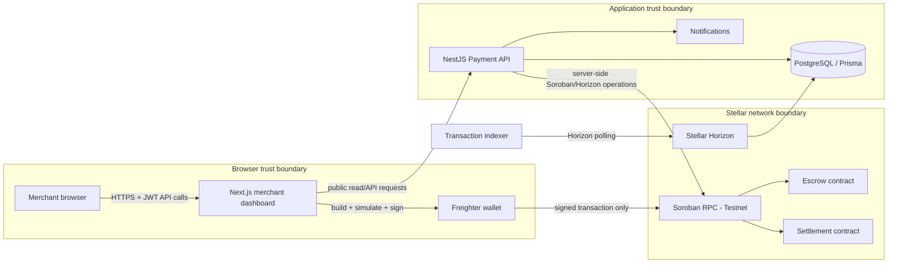
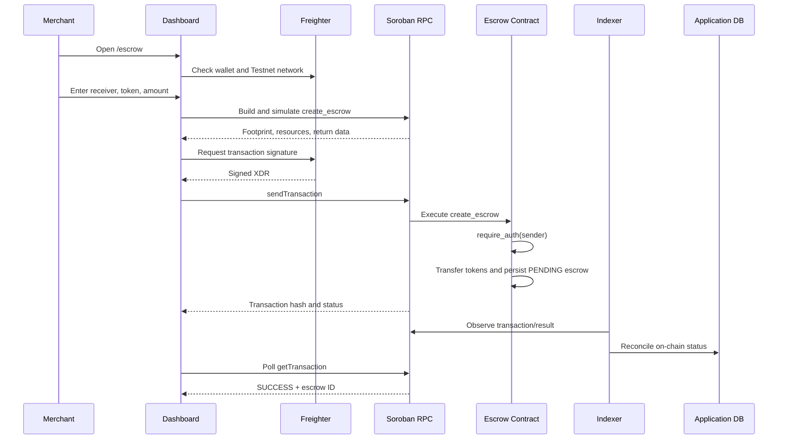
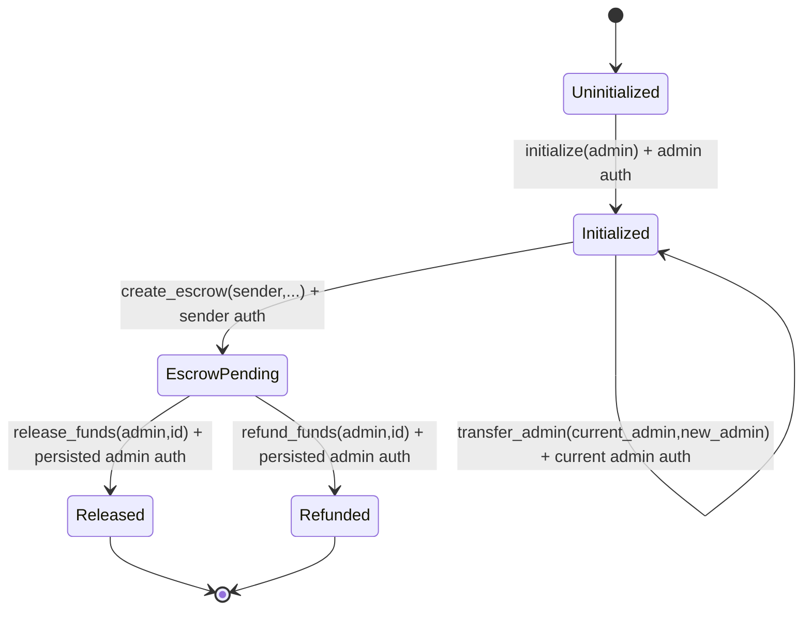
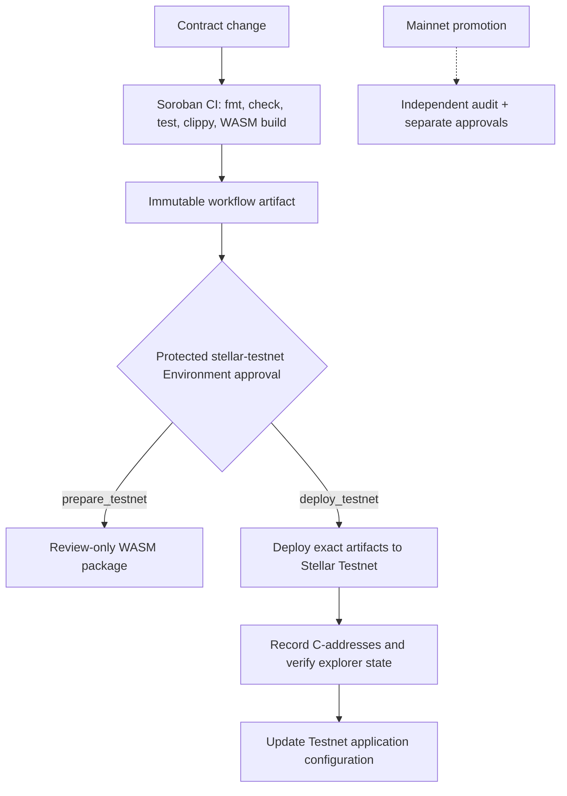

# Architecture Diagrams

These diagrams describe the current Testnet-oriented implementation. They distinguish browser wallet signing from server-side orchestration and identify the trust boundaries that must be reviewed before Mainnet use.

## Component and trust-boundary diagram

### Trust-boundary rules

- Private wallet keys stay inside Freighter and are never sent to the dashboard, API, or CI.
- Browser contract calls are restricted to Testnet by configuration and endpoint checks.
- The API may hold a server signing key for its existing backend payment path; that key must not be reused as the browser wallet identity.
- Soroban contract state and transaction results are authoritative for on-chain settlement; database rows are an indexed application view and must be reconciled.
- CI deployment secrets are scoped to the protected `stellar-testnet` GitHub Environment and are not available to pull requests.

## Payment and escrow sequence

## Administrative lifecycle

`initialize` is one-time. `transfer_admin` is the only role-change path. Existing published Testnet contracts may predate this lifecycle and must be redeployed and initialized before relying on it.

## Deployment promotion path

